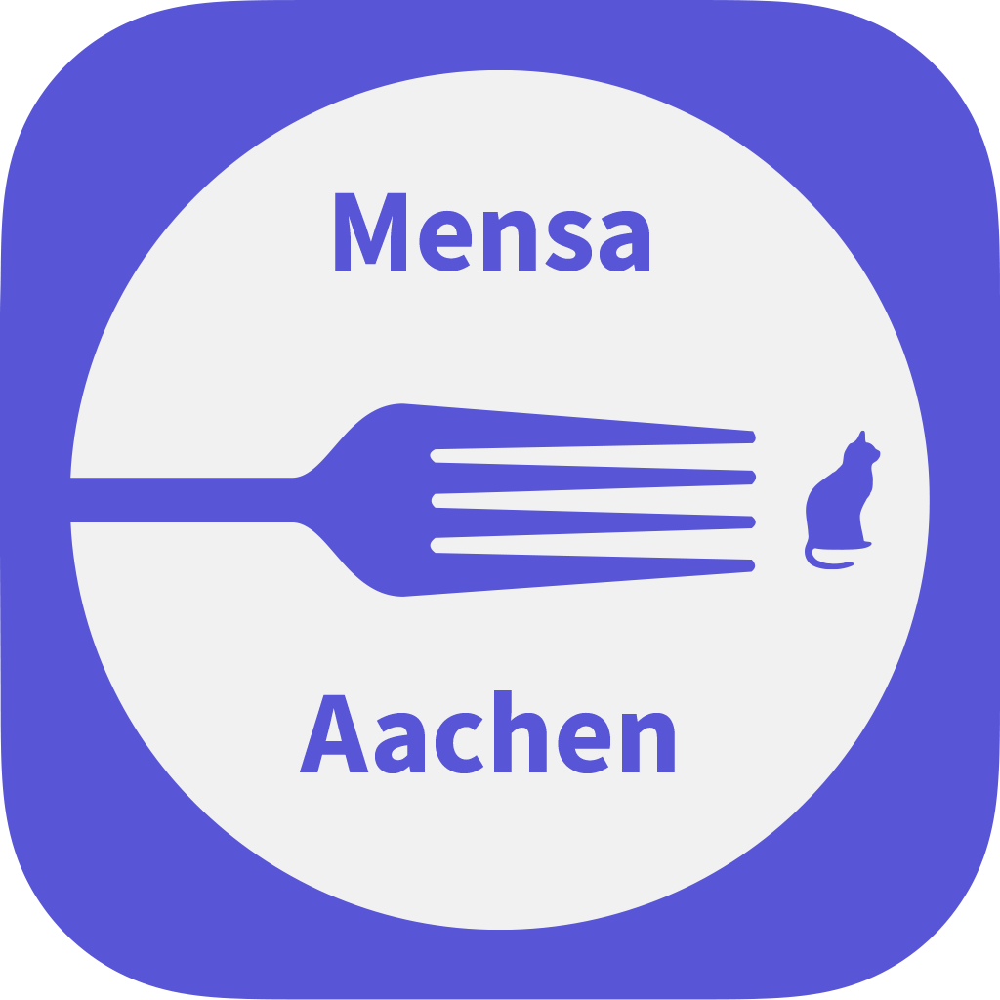

<p align="center">
  
</p>

[](https://github.com/auxua/MensaApp/tags)
[](./LICENSE)
[](https://play.google.com/store/apps/details?id=com.auxua.mensaapp)

[](https://apps.apple.com/us/app/mensa-aachen/id1010434892)


# Mensa Aachen App

A simple App for Canteens in Aachen. (Windows (10+), iOS, Android)

## License

The Source Code of the Mensa Aachen App is licensed under the MIT-License.

## Frameworks/Dependencies

This project is based on the MAUI Framework and dotnet 10.
For the Version 2.0, at least Visual Studio 2026/Rider 2025.3 and the MAUI Workloads are needed.

## Projects

The solution has multiple projects:

* MensaPortable - General Model and and Data-Management
* MensaApp - MAUI Project, targets include Win10, iOS, Android and Mac Catalyst (not tested)
* MensaConsole - Simple Testing Console Application


## Building

### iOS

1. Install XCode and accept the licences in xcode on startup
2. Use the dotnet toolchain for compiling and packaging as .ipa

```bash
dotnet publish MensaApp.csproj \
  -f net10.0-ios \
  -c Release \
  -p:RuntimeIdentifier=ios-arm64 \
  -p:ArchiveOnBuild=true
```

3. Use Xcode -> Organizer -> Archives to sign and deploy. If it does not show up, use the .ipa with Transporter app


### Android

1. Install Android SDKs (easiest way: Installing Android Studio)
2. Use the dotnet tolchaim for compiling and packaging as .apk (installation)

```bash
dotnet publish MensaApp.csproj \
  -f net10.0-android \
  -c Release
```

3. The .apk can be installed directly. Newer Versions of Google supported Android might require further steps on the user side to allow non-store apps

  
### Windows

In Case you want a self-contained App, you can execute directly, just use

```bash
dotnet publish MensaApp.csproj \
  -f net10.0-windows10.0.19041.0 \
  -c Release \
  -p:RuntimeIdentifierOverride=win-x64 \
  -p:WindowsPackageType=None \
  -p:WindowsAppSDKSelfContained=true \
  --self-contained true
```

For ARM-powered devices, this changes to

```bash
dotnet publish MensaApp.csproj \
  -f net10.0-windows10.0.19041.0 \
  -c Release \
  -p:RuntimeIdentifierOverride=win-arm64 \
  -p:WindowsPackageType=None \
  -p:WindowsAppSDKSelfContained=true \
  --self-contained true
```

Note: The execution requires all files in the _publish_ folder, not only the .exe file.

In Case, you want an installation package (MSIX), use

```bash
dotnet publish MensaApp.csproj \
  -f net10.0-windows10.0.19041.0 \
  -c Release \
  -p:RuntimeIdentifierOverride=win-x64
```